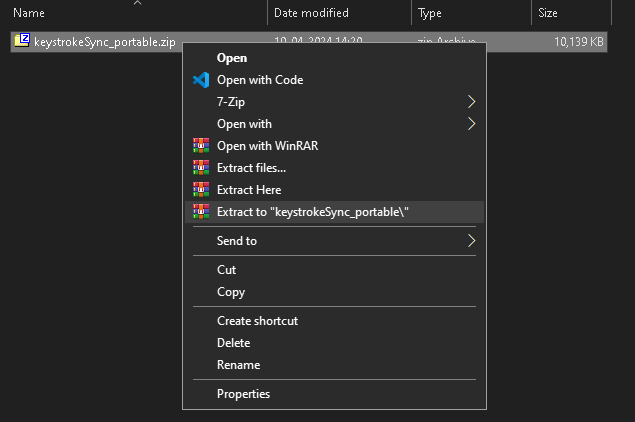
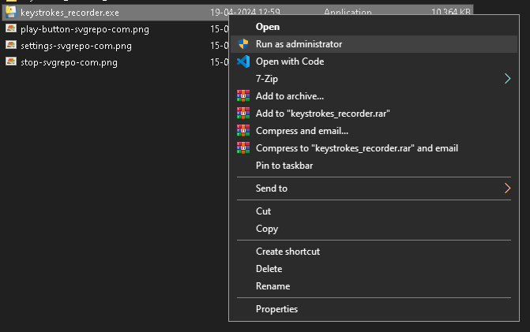
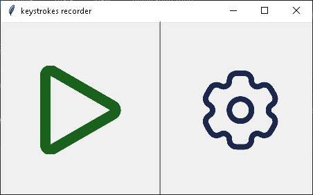
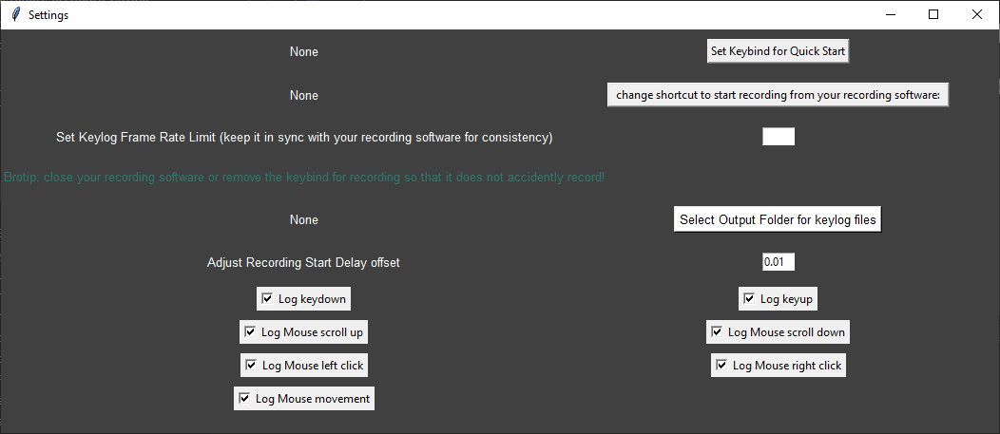
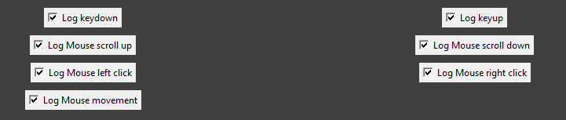

# KeystrokeSync Recorder
 KeystrokeSync is a straightforward Python application that aligns keystroke timestamps with video recordings, ensuring accurate synchronization for data analysis. It simplifies the process of correlating user actions captured through keystrokes with corresponding moments in video footage. Whether you're conducting basic data analysis or exploring machine learning applications, KeystrokeSync provides a simple solution to enhance the accuracy of your insights.  

 Note : This software DOES NOT record video itself, it just records the keystrokes and uses keybinds to start recording from a different software like OBS or nvidia share and sync those up with the starting time of the video.

# Usage

### Step 1: Download KeystrokeSync

Download the latest keystrokeSync_portable.zip release of KeystrokeSync from the [releases page](https://github.com/varungarg6756/KeystrokeSync-Recorder/releases/).

### Step 2: Extract files
Extract the downloaded portable.zip file to a folder using softwares like [WinRAR](https://www.win-rar.com/start.html?&L=0) or [7zip](https://7-zip.org/)

### Step 3: Configure Settings
Open `keystrokes_recorder.exe` by double-clicking on it.  
In some cases, the program may require administrator permissions to read and write keylog files without getting flagged by antivirus software. If KeystrokeSync doesn't work as expected, try running it as administrator.

Now you can configure the settings according to your needs. 

### Here is what each setting does:

- **Set Keybind for Quick Start** This setting allows you to define a custom shortcut keybind to start the keystroke recording easily, even while in other applications or games. 
Note : The `keystrokes_recorder.exe` must be running in the background for this to work!

- **Recording Software Shortcut:** Specify the keybind used in your video recording software to start recording. KeystrokeSync utilizes this keybind to automatically start recording and synchronize keystroke data along timestamps with video recordings.

    Note : Your Recording software must be set up and running in the background.  
 Note : This software DOES NOT record video itself, it just records the keystrokes and uses keybinds to start recording from a different software like OBS or nvidia share and sync those up with the starting time of the video.

- **FPS (Frames Per Second):** Set the recording FPS (frames per second) to match your video recording software. This helps maintain consistency between keystroke logs and video frames, enhancing accuracy during data analysis.

- **Recording Delay:** Adjust the recording delay to synchronize keystroke recording with the actual start of video recording. This compensates for any latency between pressing the recording shortcut and the start of video recording.

- **Output Folder:** Choose the directory where KeystrokeSync will save the recorded keystroke data files (txt files).

- **Customize Keylog Types:**  - **Enable/Disable Different Types of Logs:** You can now tailor the keystroke logging behavior to suit your needs. Choose which types of events to log, including keydown, keyup, mouse scroll up, mouse scroll down, mouse click left, mouse click right, and mouse movement. This feature provides increased flexibility in capturing only the data relevant to your analysis.

### I am stupid

- If you find the user interface trash or glitchy, please forgive me. I'm not proficient in UI design, and this is just a simple Python program.

- If you encounter any glitches while using this application, once again, it's on me. While I've done my best to fix any bugs I've come across, there might still be some lurking. In that case, feel free to blame me. 

- Neither am i good programmer not good ui designer so again :) 

    #### peace

